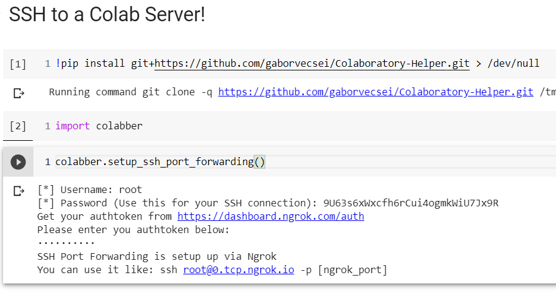

# Colabber - Google Colaboratory Helper

This repo holds functions, which contains boilerplate "helper" *Google Colab* code.

Most of the scrips and functions will be only usable and relevant with *Colab Notebooks*.

## Install

`pip install git+https://github.com/gaborvecsei/Colaboratory-Helper.git`

Then you can just easily import the module: `import colabber`

## Functions

- `colabber.take_photo()`: Takes a photo (same script as you can find in the colab snippets) with your webcam
- `colabber.setup_my_ssh_key()`: You can upload your SSH key and it will be automatically setup for usage.
This comes handy when you are working with private repos from GitHub (or other vc sites)
- `colabber.setup_ssh_port_forwarding()`: This allows you to SSH into the started Colab Server
- `colabber.terminate_ssh_port_forwarding()`: Terminates the port forwarding
